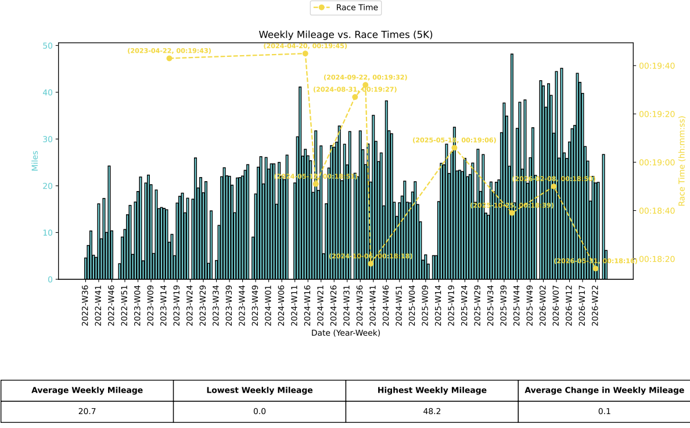
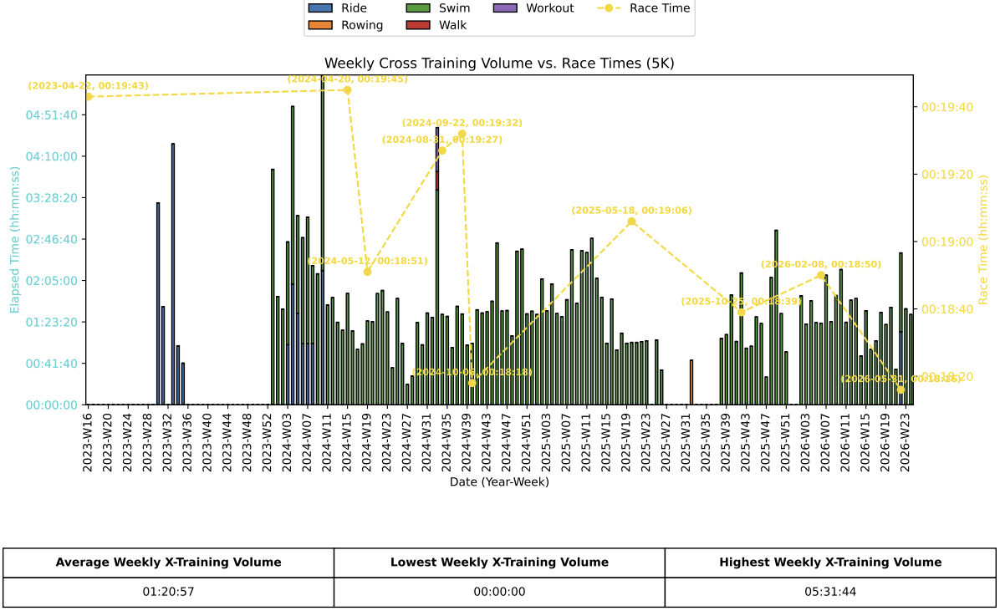
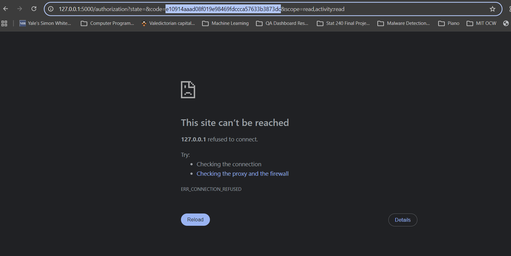

## Strava Analyzer
Want to visualize the relationship between your training and running performance? 

This application allows anybody with a Strava subscription to analyze their race performance against their training volume (e.g. weekly mileage and cross-training volume). The app pulls the user's Strava data and generates two artifacts:
- PDF report with two plots visualizing training volume against race PRs for a distance of their choice: 
    - Weekly Mileage vs. Race PRs
    - Weekly Cross-Training Volume vs. Race PRs
- Excel workbook containing these two plots along with their underlying data




### Requirements
Users must have the following installed:
- Python 3.10+

Additionally, users must have:
- A Strava subscription
- [Create an API application](https://developers.strava.com/docs/getting-started/#account) (to authorize the app to read their public activities)
- Annotate each of their Strava activities they want to be recognized as races with the "Race" tag


### Project Structure
Code:
- `strava-analyzer.py`: main executable to generate the artifacts
- `setup.py`: one-time setup for authorizing this app to collect your data and fetch API access tokens
- `refresh_token.py`: script to run when your API access token expires (expire every 6 hours)

Config:
- `.env`: holds configuration required for using the Strava API

Directories:
- `strava_data`: contains activity & PR data pulled from the Strava API in JSON format. You may specify the application to read from these files instead of calling the Strava API (which you may want to do to avoid hitting the [API rate limits](https://developers.strava.com/docs/getting-started/#basic), although they are quite generous). More info in **Usage**. 
- `reports`: directory where artifacts are written to


### Setup
All the commands assume you're on Windows, but I'm sure a little googling can get you the commands you need for Linux/MacOS :)

1. First, clone this repo & set up your [environment](https://packaging.python.org/en/latest/guides/installing-using-pip-and-virtual-environments/):
```
git clone git@github.com:jimin-kang/running-performance-analyzer.git
cd running-performance-analyzer
py -m venv .venv
source .venv/Scripts/activate
pip install -r requirements.txt
```

2. Go to your Strava account & create an API application for this app. Follow the instructions [here](https://developers.strava.com/docs/getting-started/#account). 
* Set the `Authorization Callback Domain` to `localhost`.

3. Create your `.env` as a clone of `.env.example`. Replace `STRAVA_CLIENT_ID` & `STRAVA_CLIENT_SECRET` with your Client ID & Client Secret for your API application.

4. Run `setup.py` to authorize this app to read your Strava activities and to fetch your access token.

```
py src/setup.py
```

After you authorize the app, you'll be redirected to an invalid page that looks like this:


Paste the temp authorization code embedded in the URL into the console when prompted.
Verify that your access token, refresh token, and token expiration time are written to your `.env`.

5. Now, you're ready to run the app! Refer to **Usage** for the various options to run it. 
You'll need to refresh the access token every 6 hours. To do so, run `refresh_token.py` and verify that your new token and expiration time is written to your `.env`.
```
py src/refresh_token.py
```

### Usage

#### Syntax

```bash
py src/strava-analyzer.py [OPTIONS]
```

#### Arguments

| Flag | Required | Default | Description | Example |
|------|----------|----------|----------|-------------|
| `-d`, `--distance` | Yes | N/A | Race distance to analyze. Values must be one of the following: "1 mile", "5K", "10K", "10 mile", "Half-Marathon", "Marathon". | "1 mile" |
| `-n`, `--num-races` | No | 5 | Number of races to analyze for the selected distance. I.e. if you want the top 10 races displayed in the plots, specify 10. | 10 |
| `--start-date` | No | N/A | Start date (YYYY-MM-DD) of the date range that you want to filter races & activities to. If not supplied, the app will pull activities starting from your first Strava activity. | `2026-01-01` |
| `--end-date` | No | N/A | End date (YYYY-MM-DD) of the date range that you want to filter races & activities to. If not supplied, the app will pull all historical activities after the `start-date`. | `2026-06-01` |
| `--use-cached` | No | `False` | Boolean flag to generate reports using the data in the `strava_data` folder. If not supplied, the app will default to fetch data from the Strava API. Additionally, if the cached data doesn't contain `num-races` data points for the specified race, the app will call the Strava API to get all activities.  | `--use-cached` |
| `-o`, `--output` | No | `{distance}_report_{timestamp}` | File name (w/o the extension) for the .pdf & .xlsx workbook generated. | `marathon_analysis` |

#### Example
To generate reports (named `5k_analysis.pdf/xlsx`) that visualize your top 10 historical 5K times:
```bash
py src/strava-analyzer.py \
    --distance 5K \
    --num-races 10 \
    --output 5k_analysis
```

To generate reports that visualize your top 10 5K times in 2025:
```bash
py src/strava-analyzer.py \
    --distance 5K \
    --num-races 10 \
    --start_date 2025-01-01 \
    --end_date 2025-12-31 \
    --output 5k_analysis
```


## Notes
- Dates must be specified in `YYYY-MM-DD` format.
- If no date range is specified, all historical races & activities will be processed.
- Existing output files will be overwritten.


### Known Issues 
- App will register segments within races as PRs for that shorter distance, if applicable. Ex: if a user sets a 5K PR within a 10K race, then this app will include that 5K PR when generating reports for the 5K, even though it technically wasn't a 5K race.


### Future Scope
There's only so much you can get from static reports. 
Future extensions include:
- Migrate to interactive dashboard.
- Include more running analysis beyond weekly mileage (e.g. analyze how different workouts impact race performance).
- Analyze the relationship between training & race performance instead of simply visualizing it.

